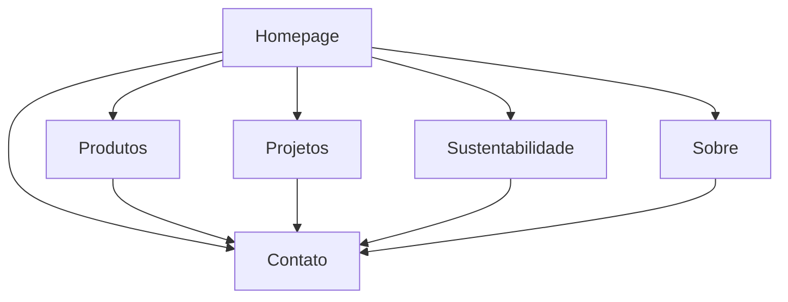

# Documento de Requisitos - Homepage Tronco Forte Madeireira

## 1. Visão Geral do Produto

Homepage moderna e impactante para a madeireira "Tronco Forte" que combina profissionalismo com a força da natureza, transmitindo qualidade superior e sustentabilidade em cada projeto.

O objetivo é criar uma experiência digital que reflita a expertise de 25+ anos da empresa no mercado madeireiro, destacando seu compromisso com práticas sustentáveis e qualidade superior.

## 2. Funcionalidades Principais

### 2.1 Papéis de Usuário

| Papel | Método de Acesso | Permissões Principais |
|-------|------------------|----------------------|
| Visitante | Acesso direto ao site | Navegar por todas as seções, visualizar produtos, solicitar orçamentos |
| Cliente Potencial | Formulário de contato | Enviar solicitações, acessar informações detalhadas |

### 2.2 Módulos de Funcionalidade

Nossa homepage da Tronco Forte consiste nas seguintes páginas principais:

1. **Homepage Principal**: hero section com vídeo, navegação, produtos em destaque, estatísticas, projetos, sustentabilidade, depoimentos, CTA final, footer
2. **Página de Produtos**: catálogo detalhado das especialidades em madeira
3. **Página de Projetos**: portfólio completo de projetos realizados
4. **Página de Sustentabilidade**: informações sobre práticas ambientais e certificações
5. **Página Sobre**: história da empresa e equipe
6. **Página de Contato**: formulários e informações de contato

### 2.3 Detalhes das Páginas

| Nome da Página | Nome do Módulo | Descrição da Funcionalidade |
|----------------|----------------|-----------------------------|
| Homepage Principal | Hero Section | Exibir vídeo de fundo cinematográfico, logo, navegação, título impactante, CTAs principais |
| Homepage Principal | Barra de Credibilidade | Mostrar certificações FSC/ISO em carrossel, estatísticas de experiência |
| Homepage Principal | Produtos em Destaque | Grid 3x2 com cards interativos dos 6 principais produtos/serviços |
| Homepage Principal | Números Impressionantes | 4 estatísticas animadas com contadores: anos, volume, satisfação, certificação |
| Homepage Principal | Projetos Destaque | Carrossel de 6 projetos com imagens, nomes, localizações e descrições |
| Homepage Principal | Sustentabilidade | Seção destacada com 3 pilares: reflorestamento, certificações, tecnologia |
| Homepage Principal | Depoimentos | 3 cards de clientes com fotos, nomes, empresas e avaliações 5 estrelas |
| Homepage Principal | CTA Final | Formulário de contato inline com informações de contato lateral |
| Homepage Principal | Footer | Logo, 4 colunas de links, redes sociais, copyright |
| Página de Produtos | Catálogo | Listar todos os produtos com filtros, imagens e especificações técnicas |
| Página de Projetos | Portfólio | Galeria completa de projetos com filtros por categoria e localização |
| Página de Sustentabilidade | Práticas Ambientais | Detalhar compromissos ambientais, certificações e processos sustentáveis |
| Página Sobre | História da Empresa | Apresentar trajetória, missão, visão, valores e equipe |
| Página de Contato | Formulários de Contato | Múltiplos formulários para diferentes tipos de solicitação |

## 3. Processo Principal

### Fluxo do Usuário Visitante:
1. **Impacto Inicial**: Usuário acessa homepage e visualiza vídeo hero que transmite profissionalismo e conexão com natureza
2. **Credibilidade**: Certificações e números geram confiança imediata
3. **Exploração**: Produtos e projetos demonstram capacidade técnica da empresa
4. **Conexão Emocional**: Seção de sustentabilidade ressalta valores ambientais
5. **Prova Social**: Depoimentos validam qualidade dos serviços
6. **Conversão**: Múltiplos pontos de contato facilitam solicitação de orçamento

## 4. Design da Interface do Usuário

### 4.1 Estilo de Design

**Paleta de Cores:**
- Verde floresta: #2D5A27 (CTAs e destaques)
- Marrom madeira: #8B4513 (elementos secundários)
- Verde claro: #7CB342 (acentos e ícones)
- Cinza carvão: #2C2C2C (textos principais)
- Off-white: #F8F6F0 (backgrounds)
- Dourado: #DAA520 (certificações e premiações)

**Tipografia:**
- Headlines: Fonte sans-serif robusta e marcante
- Corpo do texto: Fonte serif elegante
- Tamanhos: Hierarquia clara com títulos destacados

**Estilo de Botões:**
- Primários: Verde vibrante (#2D5A27) com hover animado
- Secundários: Contorno verde com preenchimento no hover
- Bordas arredondadas suaves

**Layout:**
- Estilo baseado em cards
- Navegação superior horizontal
- Grid responsivo
- Espaçamento generoso

### 4.2 Visão Geral do Design das Páginas

| Nome da Página | Nome do Módulo | Elementos da UI |
|----------------|----------------|----------------|
| Homepage Principal | Hero Section | Vídeo fullscreen, gradiente escuro 40%, logo superior esquerdo, navegação horizontal, título centralizado robusto, 2 CTAs destacados |
| Homepage Principal | Barra Credibilidade | Fundo off-white, logos certificações em carrossel, texto dourado, altura 80px |
| Homepage Principal | Produtos Destaque | Grid 3x2, cards com hover verde, ícones brancos, imagens alta qualidade |
| Homepage Principal | Estatísticas | Background textura madeira sutil, 4 contadores animados, números grandes |
| Homepage Principal | Projetos | Carrossel responsivo, imagens alta resolução, overlay com informações |
| Homepage Principal | Sustentabilidade | Background verde com ilustrações árvores, 3 colunas com ícones |
| Homepage Principal | Depoimentos | Cards brancos, fotos circulares, sistema 5 estrelas douradas |
| Homepage Principal | CTA Final | Gradiente verde escuro, formulário inline branco, informações contato lateral |
| Homepage Principal | Footer | Background cinza escuro, 4 colunas organizadas, ícones redes sociais |

### 4.3 Responsividade

**Abordagem Mobile-First:**
- Design otimizado primeiro para dispositivos móveis
- Navegação simplificada em telas menores
- Grid adaptativo que reorganiza conteúdo
- Vídeo hero otimizado para mobile
- Formulários touch-friendly
- Performance otimizada com lazy loading
- Interações touch otimizadas

**Elementos Visuais e Interações:**
- Micro-animações: Fade-in ao scroll, hover effects suaves
- Ícones: Set consistente relacionado à madeira, construção e sustentabilidade
- Imagens: Alta qualidade com filtros consistentes, tons terrosos
- CTAs estratégicos com cores contrastantes e micro-animações